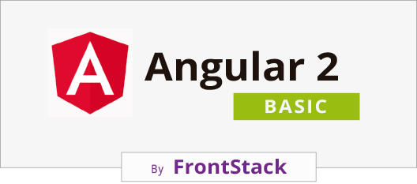

# Angular2 Basic

This starter kit is under construction.

 
# Getting Started
## Dependencies
What you need to run this app:
* `node` and `npm` (`brew install node`)
* Ensure you're running the latest versions Node `v4.x.x`+ (or `v5.x.x`) and NPM `3.x.x`+
* We recommend to use `yarn` (`npm install -g yarn`) instead of npm

> If you have `nvm` installed, which is highly recommended (`brew install nvm`) you can do a `nvm install --lts && nvm use` in `$` to run with the latest Node LTS. You can also have this `zsh` done for you [automatically](https://github.com/creationix/nvm#calling-nvm-use-automatically-in-a-directory-with-a-nvmrc-file) 

Once you have those, you should install these globals with `yarn install --global`:
* `webpack` (`yarn install --global webpack`)
* `webpack-dev-server` (`yarn install --global webpack-dev-server`)
* `karma` (`yarn install --global karma-cli`)
* `protractor` (`yarn install --global protractor`)
* `typescript` (`yarn install --global typescript`)

## Installing
* `fork` this repo
* `clone` your fork
* `yarn install webpack-dev-server rimraf webpack -g` to install required global dependencies
* `yarn install` to install all dependencies or `yarn`
* `yarn run serve` to start the dev server in another tab

## Running the app
After you have installed all dependencies you can now run the app. Run `yarn run serve` to start a local server using `webpack-dev-server` which will watch, build (in-memory), and reload for you. The port will be displayed to you as `http://0.0.0.0:3000` (or if you prefer IPv6, if you're using `express` server, then it's `http://[::1]:3000/`).

### server
```bash
# development
yarn run serve
# production
yarn run build